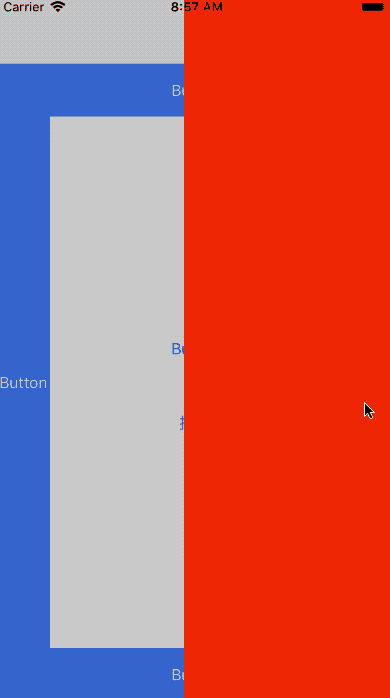

# PopupSheet



## Requirements

- iOS 8.0+
- Swift 4

## Installation

### Carthage

You can use [Carthage](https://github.com/Carthage/Carthage) to install `PopupSheet` by adding it to your `Cartfile`:
```
github "cbahai/PopupSheet"
```
Or

```
git "ssh://gitlab/fengyonghai/PopupSheet.git"
```

## Usage

```swift
import PopupSheet
```

```swift
let psvc = PopupSheetViewController.newInstance(withContent: UIView()/*or `UIViewController()`*/, direction: .up)
psvc.offset = 50
psvc.show(in: aViewController)
```
